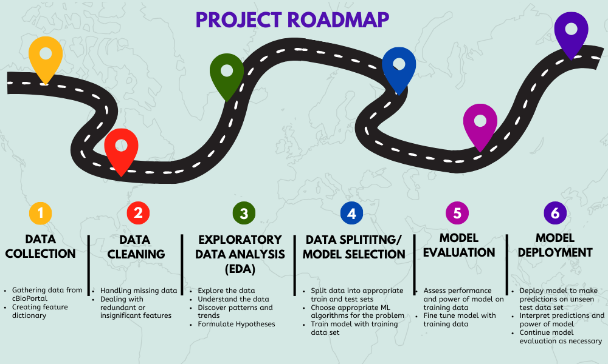

 

  # 🧬 weCAN: A Cancer Survivability Predictor 🧬
### Machine Learning and Cancer Survivability

  </a>

## 🔎 Project Overview 

This project utilizes Machine Learning techniques to attempt to increase the accuracy of estimating cancer prognosis and survivability using demographic features as well as disease status, progression and genetic.  If successful, it will  aid in the improvement of the quality of life for patients and their loved ones. 

## 📖 Table of Contents
  
  <ol>
    <li><a href="#motivation">Project Motivation</a></li>
    <li><a href="#data">The Data</a></li>
    <li><a href="#dict">Data Dictionary</a></li>
    <li><a href="#roadmap">Project Roadmap</a></li>
    <li><a href="#learnings">Learnings</a></li>
  </ol>

(<a href="#readme-top">back to top</a>)

<h2 id="motivation"> 💪🏽 Project Motivation </h2>

The motivation for this project is a a personal and professional connection to cancer. Like the majority of people I have been personally, indirectly affected by cancer. I also worked in clinical cancer diagnosis and detection for 7+ years and have a deep seeded interest in the field.  Cancer prognosis and survivability affects patients, their friends and family, and their quality of life.

Accuracy in prognosis predictions is very important. When a patient is given a prognosis, they begin to map out the remainder of their time.  When the prognosis is inaccurate, some are lucky and they are given more time but there are some that are not so lucky and are taken sooner than anticipated.  Accurate prognosis can also help the currently overwhelmed and under-funded and under-staffed healthcare systems around the world. It can help with resource mangement to alloccate precious time, space and treatment resources to those who will benefit the most.

Cancer prognosis affects everyone involved from pateints to families to health care staff and I hope to develop a model that can better predict this metric to make living with cancer better for everyone.

<h2 id="data">📊 The Data</h2>
The data used for this project was downloaded from the cBioPortal for Cancer genomics:
https://www.cbioportal.org/study/summary?id=msk_met_2021 from the MSK MetTropism (MSK, Cell 2021) study. 

This public site is hosted by the Centre for Molecular Oncology at the Memorial Sloan Kettering Cancer Centre.

Each of the 25775 instances are a unique pateint in the study with each column a different attirbute of this patient and their disease.
Including:

<h2 id="dict"> 📖 Data Dictionary</h2>
  
<table>
  <tr>
    <th style="text-align: left; background: lightgrey">Column Name</th>
    <th style="text-align: left; background: lightgrey">Description</th>
  </tr>
  <tr>
    <td style="text-align: left"> <code>Study ID</code> </td>
    <td style="text-align: left">ID for the Study where the data is from</td>
  </tr>
  <tr>
    <td style="text-align: left"><code>Patient ID</code></td>
    <td style="text-align: left">Unique patient identifier</td>
  </tr>
  <tr>
    <td style="text-align: left"><code>Sample ID</code></td>
    <td style="text-align: left">Unique sample identifier</td>
  </tr>
  <tr>
    <td style="text-align: left"><code>Age at Death</code></td>
    <td style="text-align: left">Age at which patient died (blank indicated patient is alive at time of study)</td>
  </tr>
  <tr>
    <td style="text-align: left"><code>Age at First Mets Dx</code></td>
    <td style="text-align: left">Age at which patient was diagnosed with metastatic cancer</td>
  </tr>
  <tr>
    <td style="text-align: left"><code>Age at Last Contact</code></td>
    <td style="text-align: left">Age at which the study made last contact with the patient</td>
  </tr>
  <tr>
    <td style="text-align: left"><code>Age at Sequencing</code></td>
    <td style="text-align: left">Age at which the patients tumour was genetically sequenced</td>
  </tr>
  <tr>
    <td style="text-align: left"><code>Age at Surgical Procedure</code></td>
    <td style="text-align: left">Age at which patentee underwent surgery to remove tumour</td>
  </tr>
  <tr>
    <td style="text-align: left"><code>Cancer Type</code></td>
    <td style="text-align: left">Type of cancer at diagnosis</td>
  </tr>
  <tr>
    <td style="text-align: left"><code>Cancer Type Detailed</code></td>
    <td style="text-align: left">Detailed description of cancer type</td>
  </tr>
  <tr>
    <td style="text-align: left"><code>Distant Mets: Adrenal Gland</code></td>
    <td style="text-align: left">Presence or absence of distant Metastasis at Diagnosis in the Adrenal Gland</td>
  </tr>
  <tr>
    <td style="text-align: left"><code>Distant Mets: Biliary tract</code></td>
    <td style="text-align: left">Presence or absence of distant Metastasis at Diagnosis in the Biliary tract </td>
  </tr>
  <tr>
    <td style="text-align: left"><code>Distant Mets: Bladder/UT</code></td>
    <td style="text-align: left">Presence or absence of distant Metastasis at Diagnosis in the Bladder/Urinary Tract </td>
  </tr>
  <tr>
    <td style="text-align: left"><code>Distant Mets: Bone</code></td>
    <td style="text-align: left">Presence or absence of distant Metastasis at Diagnosis in Bone </td>
  </tr>
  <tr>
    <td style="text-align: left"><code>Distant Mets: Bowel</code></td>
    <td style="text-align: left">Presence or absence of distant Metastasis at Diagnosis in the Bowel</td>
  </tr>
  <tr>
    <td style="text-align: left"><code>Distant Mets: Breast</code></td>
    <td style="text-align: left">Presence or absence of distant Metastasis at Diagnosis in the Breast tissue</td>
  </tr>
  <tr>
    <td style="text-align: left"><code>Distant Mets: CNS/Brain</code></td>
    <td style="text-align: left">Presence or absence of distant Metastasis at Diagnosis in the Central Nervous System(spinal cord)/Brain </td>
  </tr>
  <tr>
    <td style="text-align: left"><code>Distant Mets: Distant LN</code></td>
    <td style="text-align: left">Presence or absence of distant Metastasis at Diagnosis in distant Lymph Nodes</td>
  </tr>
   <tr>
    <td style="text-align: left"><code>Distant Mets: Female Genital</code></td>
    <td style="text-align: left">Presence or absence of distant Metastasis at Diagnosis in female genitalia</td>
  </tr>
   <tr>
    <td style="text-align: left"><code>Distant Mets: Head and Neck</code></td>
    <td style="text-align: left">Presence or absence of distant Metastasis at Diagnosis in the head or neck</td>
  </tr>
   <tr>
    <td style="text-align: left"><code>Distant Mets: Intra-Abdominal</code></td>
    <td style="text-align: left">Presence or absence of distant Metastasis at Diagnosis in the intra abdominal area</td>
  </tr>
   <tr>
    <td style="text-align: left"><code>Distant Mets: Kidney</code></td>
    <td style="text-align: left">Presence or absence of distant Metastasis at Diagnosis in the kidneys</td>
  </tr>
   <tr>
    <td style="text-align: left"><code>Distant Mets: Liver</code></td>
    <td style="text-align: left">Presence or absence of distant Metastasis at Diagnosis in the liver </td>
  </tr>
   <tr>
    <td style="text-align: left"><code>Distant Mets: Lung</code></td>
    <td style="text-align: left">Presence or absence of distant Metastasis at Diagnosis in the lungs</td>
  </tr>
   <tr>
    <td style="text-align: left"><code>Distant Mets: Male Genital</code></td>
    <td style="text-align: left">Presence or absence of distant Metastasis at Diagnosis in the male genitalia</td>
  </tr>
   <tr>
    <td style="text-align: left"><code>Distant Mets: Mediastinum</code></td>
    <td style="text-align: left">Presence or absence of distant Metastasis at Diagnosis in the mediastinum</td>
  </tr>
   <tr>
    <td style="text-align: left"><code>Distant Mets: Ovary</code></td>
    <td style="text-align: left">Presence or absence of distant Metastasis at Diagnosis in the ovaries</td>
  </tr>
   <tr>
    <td style="text-align: left"><code>Distant Mets: Pleura</code></td>
    <td style="text-align: left">Presence or absence of distant Metastasis at Diagnosis in pleural tissue</td>
  </tr>
   <tr>
    <td style="text-align: left"><code>Distant Mets: PNS</code></td>
    <td style="text-align: left">Presence or absence of distant Metastasis at Diagnosis in the peripheral nervous system</td>
  </tr>
   <tr>
    <td style="text-align: left"><code>Distant Mets: Skin</code></td>
    <td style="text-align: left">Presence or absence of distant Metastasis at Diagnosis in the skin </td>
  </tr>
  <tr>
    <td style="text-align: left"><code>Distant Mets: Unspecified</code></td>
    <td style="text-align: left">Presence or absence of distant Metastasis at Diagnosis in unspecified regions</td>
  </tr>
  <tr>
    <td style="text-align: left"><code>FGA</code></td>
    <td style="text-align: left">Fraction Genome Altered (rounded)</td>
  </tr>
  <tr>
    <td style="text-align: left"><code>Fraction Genome Altered</code></td>
    <td style="text-align: left">Fraction Genome Altered indicates the fraction of the genome that is copy-number altered. Add the length of all copy-number segments with an absolute value greater than 0.1 and then divide that number by the length of the genome. The resulting number is a fraction.</td>
  </tr>
  <tr>
    <td style="text-align: left"><code>Gene Panel</code></td>
    <td style="text-align: left">ID of the gene panel used for genetic sequencing</td>
  </tr>
  <tr>
    <td style="text-align: left"><code>Metastatic patient</code></td>
    <td style="text-align: left">True or False: if patient had metastatic disease or not</td>
  </tr>
  <tr>
    <td style="text-align: left"><code>Metastatic Site</code></td>
    <td style="text-align: left">The anatomic location where tumour has spread</td>
  </tr>
  <tr>
    <td style="text-align: left"><code>Met Count</code></td>
    <td style="text-align: left">Number of metastasis found</td>
  </tr>
  <tr>
    <td style="text-align: left"><code>Met Site Count</code></td>
    <td style="text-align: left">Number of different metastatic sites</td>
  </tr>
  <tr>
    <td style="text-align: left"><code>MSI Score</code></td>
    <td style="text-align: left">Numerical value of the amount of Microsatellite Instability found in the tumour</td>
  </tr>
  <tr>
    <td style="text-align: left"><code>MSI Type</code></td>
    <td style="text-align: left">Does tutor exhibit Microsatellite Instability</td>
  </tr>
  <tr>
    <td style="text-align: left"><code>Mutation Count</code></td>
    <td style="text-align: left">Number of gene mutations found</td>
  </tr>
  <tr>
    <td style="text-align: left"><code>Oncotree Code</code></td>
    <td style="text-align: left">The OncoTree is an open-source ontology that was developed at Memorial Sloan Kettering Cancer Center (MSK) for standardizing cancer type diagnosis from a clinical perspective by assigning each diagnosis a unique OncoTree code.</td>
  </tr>
  <tr>
    <td style="text-align: left"><code>Organ System</code></td>
    <td style="text-align: left">Organ System where the cancer was found</td>
  </tr>
  <tr>
    <td style="text-align: left"><code>Overall Survival (Months)</code></td>
    <td style="text-align: left">Number of months that patient survived from initial diagnosis</td>
  </tr>
  <tr>
    <td style="text-align: left"><code>Overall Survival Status</code></td>
    <td style="text-align: left">Survival status:
0:LIVING, 1:DECEASED</td>
  </tr>
  <tr>
    <td style="text-align: left"><code>Primary Tumor Site</code></td>
    <td style="text-align: left">The organ sub-division where the primary tumour was found</td>
  </tr>
  <tr>
    <td style="text-align: left"><code>Race Category</code></td>
    <td style="text-align: left">Patient information about race</td>
  </tr>
  <tr>
    <td style="text-align: left"><code>Number of Samples Per Patientn</code></td>
    <td style="text-align: left">Number of samples taken per patient in the study</td>
  </tr>
  <tr>
    <td style="text-align: left"><code>Sample coverage</code></td>
    <td style="text-align: left">The number of unique sequencing reads that align to a region in a reference genome</td>
  </tr>
  <tr>
    <td style="text-align: left"><code>Sample Type</code></td>
    <td style="text-align: left">Primary tumour or metastasis</td>
  </tr>
  <tr>
    <td style="text-align: left"><code>Sex</code></td>
    <td style="text-align: left">Biological gender at birth</td>
  </tr>
  <tr>
    <td style="text-align: left"><code>Subtype</code></td>
    <td style="text-align: left">Cancer subtype</td>
  </tr>
  <tr>
    <td style="text-align: left"><code>Subtype Abbreviation</code></td>
    <td style="text-align: left">Cancer subtype abbreviation</td>
  </tr>
  <tr>
    <td style="text-align: left"><code>TMB (nonsynonymous)</code></td>
    <td style="text-align: left">The number of non-synonymous mutations within coding regions across the genome. Non-synonymous mutations alter coding regions and change the resulting protein into dysfunctional or malformed protein products.</td>
  </tr>
  <tr>
    <td style="text-align: left"><code>Tumor Purity</code></td>
    <td style="text-align: left">The proportion of tumour cells in the tumour micro environment (TME)</td>
  </tr>
</table>

(<a href="#readme-top">back to top</a>)

<h2 id="roadmap"> 🚙 Project Roadmap </h2>

(<a href="#readme-top">back to top</a>)

Project progression:

Thus far I have completed the `Data Collection`, the preliminary `Data Cleaning` and the initial `EDA`.  
I have preformed my first iterations of feature selection and engineering.
I have perfomred my first iterations of the baseline ML models. I have determined this will be a classification problem, classifying patients into 1 of 4 survival duration categories:
- < 1 year
- 1-2 years
- 2-4 years
- > 4 yeas

I have fit baseline models for:
- Multiclass Logistic Regression
- K Nearest Neighbors
- Decision Tree Classifier
- Random Forest Classifier
  
My next steps will be:
- Iterate over feature selection and engineering to transform feature space to get more predictive power from my models.
- Optimize hyperparameters for the best performing model(s).
- Test out Neural Networks.
- Implement model.

Stay tuned for updates! 

<h2 id="learnings"> 💡 Learnings </h2>

Some learnings from the EDA and Feature Engineering (AHA! moments):
- Knowledge of the problem space is very important, was able to boost my model's performance by removing features I knew were not necessary.
- Originally trying to perform regression modelling, realized this does not work as a regression model but needs to be a classification model.

(<a href="#readme-top">back to top</a>)

